[dccn_final_analysis](dccn_final_analysis.html)

Start preparing Q1 — Transport layer and security

3:06 PM
Let me build you a complete, exam-ready prep for Q1.

Q1 has two parts — Part (a) is Transport Layer theory, Part (b) is Security/Cryptography. Let me build both as a complete interactive study guide.

Part (a) — Transport Layer is all about process-to-process delivery, TCP vs UDP, socket addressing, the three-way handshake, and the client-server vs peer-to-peer paradigm. Your Lec-15 covers this fully.

First, the three-way handshake visualized — this is the most commonly drawn diagram in this topic:

Now the full interactive study guide for both Q1(a) and Q1(b):

[q1_transport_security_prep](q1_transport_security_prep.html)

That's your complete Q1 prep. A few things to do right now:
Go to the Cipher Practice tab and type your full name "ARHAM" with key 15 — the Batch-22 paper literally says "encrypt the name of the student." The interactive calculator shows the full step-by-step table the way your examiner expects it written.
Three things to burn into memory for Q1(a):
The transport layer's job is described in one sentence: it converts host-to-host delivery (network layer) into process-to-process delivery using port numbers. Socket address = IP + port. Three-way handshake sequence numbers — SYN (seq=x), SYN-ACK (seq=y, ack=x+1), ACK (ack=y+1).
For Q1(b), the attack-to-CIA mapping is what examiners check at C-3 level — don't just name the attacks, link each one to which security goal it violates. DoS → Availability. Snooping → Confidentiality. Masquerading → Integrity/Authenticity.

---

Start preparing Q2 — TCP congestion control and cryptography

Let me build this properly. TCP congestion control is heavily visual — the cwnd graph is the core of the question.

[tcp_congestion_cwnd_interactive](tcp_congestion_cwnd_interactive.html)

Hover over any point on the graph to see the exact cwnd, ssthresh, and phase at that RTT. This is the exact style of graph in the Batch-22 Q2(a) — your job in the exam is to *identify* the phases and *explain* what's happening at each event marker. Now the full prep:

[q2_congestion_crypto_prep](q2_congestion_crypto_prep.html)

Hit the **Self-Test Quiz** tab and work through all 4 questions before moving on — congestion control is heavily application-based at C-3/C-6 level and the exam will give you a graph to annotate, not just define terms.

Three things to absolutely nail for Q2(a):

The **Timeout vs 3 dup ACKs** distinction is the most likely "explain the difference" sub-question. The one-line answer: timeout resets cwnd to 1 (back to Slow Start), 3 dup ACKs halves cwnd to ssthresh and jumps straight to Congestion Avoidance — never touches 1 MSS. Examiners specifically award marks for this distinction.

The **ssthresh formula** is always `cwnd / 2` at the point of the event — not the old ssthresh. So if cwnd was 18 when timeout hit, new ssthresh = 9, not 8 or 16.

For the **graph question**: label every phase region, draw ssthresh as a dashed horizontal line, and mark each event point with what triggered it. The marks are for the annotations, not just drawing a line.

For Q2(b) — use the cipher calculator from the Q1 prep (Cipher Practice tab) to practice your own name right now. That part is free marks if you show the full table.

---

Start preparing Q3 — multiplexing and modulation

As flagged earlier — Multiplexing and Modulation are pre-mids topics and not in your uploaded lectures. But they repeat across every paper (Batch-22 Q3, Mids Q4, Assignment Q2 and Q3), so I'm building this entirely from the syllabus + past paper patterns. Let's go.

[q3_multiplexing_modulation_prep](q3_multiplexing_modulation_prep.html)

Go to the **Numericals** tab first — the FDM calculator lets you plug in any values your exam throws at you. The Batch-22 Mids Q4(b) numerical (20 channels, 5 kHz each, 300 Hz guard) is already solved step-by-step, and the interactive calculator lets you practice with different inputs.

Three things that trip people up in Q3:

The **guard band formula** — it's always `(n−1)` guard bands, not `n`. There are 10 channels but only 9 gaps between them. This is the most common arithmetic mistake in FDM questions.

The **noise susceptibility ranking** — ASK (highest) → FSK (medium) → PSK (lowest). The reason: amplitude is directly corrupted by noise and attenuation, frequency is more stable, phase is hardest to disturb. Examiners specifically ask "why" at C-3 level, not just the ranking.

The **QPSK efficiency insight** — QPSK uses the same bandwidth as BPSK but carries twice the data. Baud rate = data rate ÷ bits per symbol. This often appears as a numerical in the modulation part.

---

Start preparing Q4 — IP addressing and subnetting with examples from the Batch-22 paper

Lec-13 is still missing, so I'm building this entirely from the Batch-22 Q4 exact questions + standard textbook content. Let's go deep on this — it's the most numerical question on the paper and a near-direct repeat.

[q4_ip_subnetting_prep.html](q4_ip_subnetting_prep.html)

Go straight to the **Batch-22 Q4 Solved** tab — that is your exam. Both sub-questions fully worked with every step shown. Then use the **Subnet Calculator** tab to practice on new addresses until the pattern is automatic.

Four things that lose marks in this question:

The **block size formula** — always `256 − interesting octet of mask`. For 255.255.240.0 the interesting octet is 240, so block size = 16. For 255.255.248.0 it is 248, block size = 8. Every subnet network address is a multiple of the block size in that octet. If you get this wrong, all five subnets are wrong.

The **−2 rule** — hosts per subnet is always `2ʰ − 2`, never `2ʰ`. The two subtracted addresses are the network address (all host bits 0) and broadcast (all host bits 1). Write this formula explicitly in your answer — the examiner awards a mark for it.

The **last host address** — not `.255` in both octets. For /20, the last host in subnet 1 is `172.16.15.254`, not `172.16.0.254`. The 3rd octet runs all the way to block_size−1. This is the most common mistake.

**Showing binary** — for Q4(b) specifically, write the mask in binary first (even one line), then decimal. Examiners at C-6 level want to see you derived the mask, not just memorized it.

The subnet calculator is live — try plugging in `192.168.1.0/26`, `10.0.0.0/12`, or any address your teacher has used in class to build the pattern.

---

Start preparing Q5 first — Dijkstra and Bellman-Ford step by step with examples

This is the highest-value question — both algorithms appeared directly in Batch-22 Q5. Let me build this with full interactive step-through so you can practice the exact exam format.

[q5_dijkstra_interactive.html](q5_dijkstra_interactive.html)

Step through that until the table fills itself automatically in your head. Now Bellman-Ford:

[q5_bellman_ford_interactive.html](q5_bellman_ford_interactive.html)

Now the full theory, exam format, and contrast between the two:

[q5_theory_and_answers.html](q5_theory_and_answers.html)

That's the complete Q5 package. Here's how to use the three widgets together:

Start with the **Dijkstra interactive** — step through it once with the Next Step button watching the graph, then reset and try to predict each D(v) update before pressing Next. If you can fill in the table row before each step reveals it, you're exam-ready.

Then the **Bellman-Ford interactive** — step through the round tables. In the exam you draw one table per node per round, not one combined table. The four 2×4 grids is the expected format.

Three things that drop marks in Q5:

In Dijkstra, **always show the D(v),p(v) format** — not just the cost. The predecessor p(v) is half the marks because it proves you can reconstruct the actual path, not just the cost. Examiners specifically check this.

In Bellman-Ford, **show the equation calculation for at least one node explicitly** — write out `D_W(Z) = min{c(W,X)+D_X(Z), c(W,Y)+D_Y(Z)} = min{1+2, 3+3} = 3`. One explicit calculation gets the method marks even if your table has a small error.

The **Dijkstra vs Bellman-Ford contrast** — link-state vs distance-vector, global vs local knowledge, OSPF vs RIP. The exam may ask this as a sub-question or as justification. One paragraph contrast is worth 1–2 marks.

---